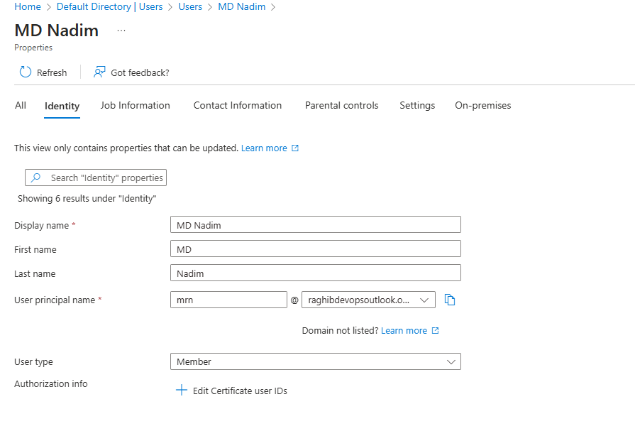

1. Create new email on microdoft
raghibdevops@outlook.com

2. Create microsoft new account using new email 

3. signup azure account

4. Once you login to azure portal using personal email, that email cant be used to login into microsoft portal

5. Go to ENtraID -> Manage -> Users -> Slelect your username -> Edit properties -> Save

6. Logout and login with new prinipal username
- May be you need to reset the password

7. Now you can login to microsoft 365 porta
- Now you get free license to Entra ID, but it has some limitation

8. Activate Entra ID premium 2
- GO to market place 
- search for Entra
- Select entra ID Premium 2
- get the license
- assign license
